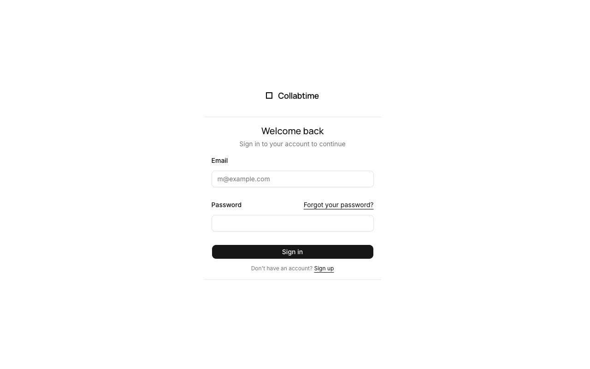
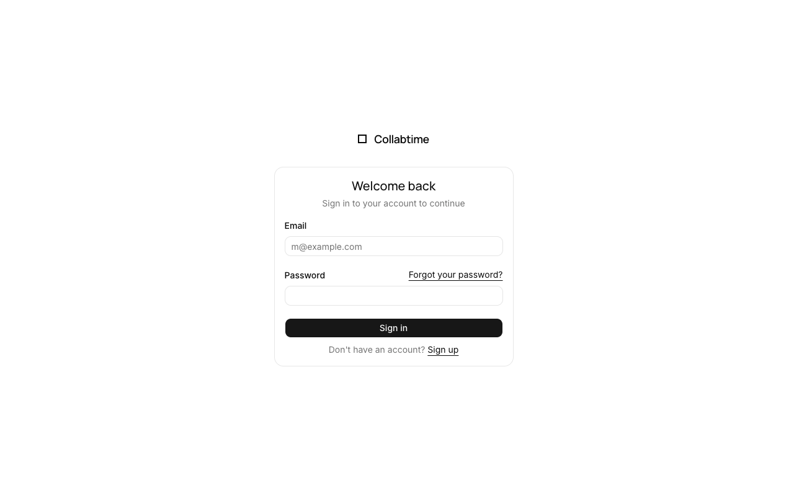
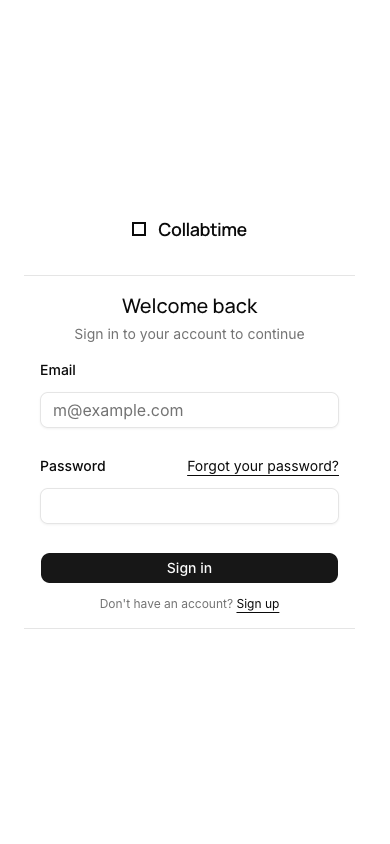
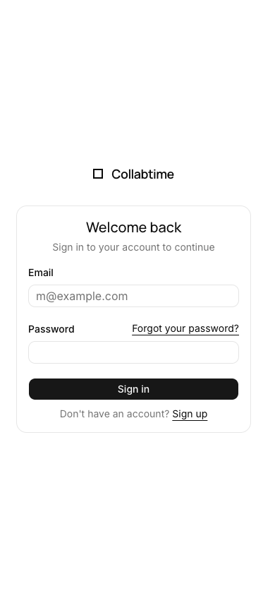

# shadcn visual comparison

Before: `f8eb971652cd5a95fdf4e95f602168d644b89675` (PR merge base).

After UI source: `9d46e859bab357f3cc696f07bb69f6d08c1b5d8a`. Later commits in this PR only add review evidence.

The flat form with top/bottom rules becomes a rounded stock card. Inputs are shorter and form spacing is tighter; the monochrome identity remains.

Manually compared matching desktop (1280×800) and mobile (390×844) viewports in Chromium, light theme, reduced motion. No horizontal overflow or unexpected clipping was observed in the sampled after states. This covers the pages/states below, not every screen, authenticated flow, or dark-mode state.

## Empty login form

App: `web`. Route: `/login`. Same route and state on both commits.

Desktop

| Before                              | After                             |
| ----------------------------------- | --------------------------------- |
|  |  |

Mobile

| Before                             | After                            |
| ---------------------------------- | -------------------------------- |
|  |  |
